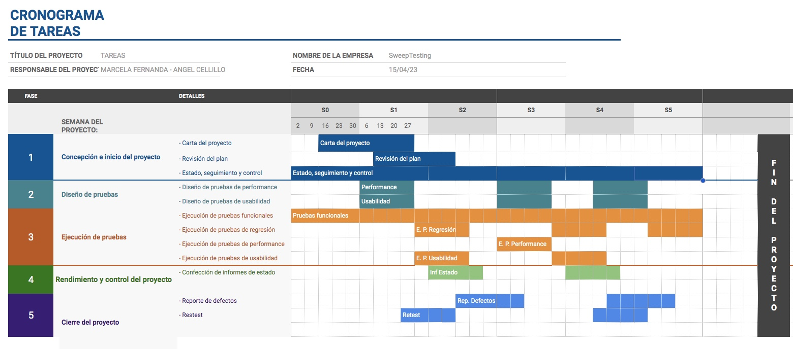


## PLAN DE PRUEBAS

### Proyecto:
        Bot Apettite      
### Cliente:
        Nicolás
### Fecha:
        2023-04-03
### Objetivo:

	- Evaluar la funcionalidad de navegación de la aplicación fastFood.app para validar y verificar que el sitio de una buena experiencia de usuario a quien llegue hasta él, satisfaciendo sus expectativas. 
	- Reducir al mínimo los errores en producción.
	- Detectar y proponer oportunidades de mejora
	- Verificar que el sistema coincida con sus especificaciones.

### Alcance:
        Se verificara la funcionalidad de la pagina, el comportamiento al momento de seleccionar las categorias de productos, las vistas de los mismos y sus especificaciones.

### Quedará fuera del alcance:
				- las pruebas de seguridad
				- verificar que la aplicación sea funcionalmente amigable para su usabilidad
				- verificar que el sistema coincida con sus especificaciones

### Equipo
        El equipo de pruebas estará conformado por Angel Cellillo, tester manual

        Estarán prestando servicio desde home office, Argentina, full time.

### Estrategia

- El equipo de testing realizará pruebas funcionales de manera manual
- Cada vez que una nueva versión llegue a testing se hará una prueba de regresión sobre aquellos escenarios que se consideren de prioridad alta. 
- Al finalizar cada sprint se realizarán pruebas de aceptación de usuario, fuera del alcance del equipo de testing, a cargo del UX
- Se aprovecharán esas reuniones para hacer pruebas de usabilidad, fuera del alcance del equipo de testing, a cargo del UX
- A lo largo del proyecto se harán pruebas manuales tanto funcionales, de caja negra
- Las pruebas UAT y las pruebas de usabilidad quedarán a cargo del equipo de UX, las pruebas unitarias estarán a cargo del equipo de desarrollo
- Testing intervendrá en los niveles de integración y sistema

### Criterios

- El criterio de finalización de las pruebas será cuando se hayan ejecutado todas las pruebas planificadas o, si el tiempo apremia, al menos se hayan ejecutado los casos de prueba de prioridad alta y media. 
- El criterio para pasar a producción será que no haya errores bloqueantes o críticos sin resolver.

### Ambiente de pruebas del equipo de Testing

		Desktop computer ASUS 64 bit
		8 Gig Ram DIMM DDR3

		Operating System: Ubuntu 22.04.2 LTS              
		Kernel: Linux 5.19.0-40-generic
		Architecture: x86-64
		Hardware Vendor: ASUS
		Hardware Model: All Series

### Herramientas de gestión de incidentes: 

		Asana

### Restricciones y Dependencias

	Se consideran los siguientes ítems como posibles restricciones y dependencias que no permitan cumplir con la ejecución de las tareas de testing en tiempo y forma:
		• Datos de prueba a entregar por el cliente.
		• Funcionalidad no disponible en el ambiente, o que dificulten el comienzo de la ejecución de las pruebas.
		• Inconvenientes técnicos con la disponibilidad del ambiente de pruebas.

### Entregables

Los entregables que se generarán son: 
- Plan de pruebas
- Lista de escenarios de pruebas ejecutadas 
- Reporte de defectos

### Gestión de Incidente

Se utilizará el siguiente workflow para la gestión de defectos 

!(Workflow)[/images/incident-workflow.png]

### Severidad y prioridad

La severidad será asignada por el tester y la prioridad por el product owner. 

Las severidades que se utilizarán serán: 
	
	- Bloqueante: cuando una funcionalidad no se pueda utilizar y no haya otra forma de realizar esa misma acción. 

	- Crítica: cuando una funcionalidad no se pueda utilizar pero exista un camino alternativo para realizar eso mismo. 

	- Alta: cualquier defecto sobre una funcionalidad prioritaria del sistema o que tiene impacto secundario en una funcionalidad prioritaria del mismo.

	- Medio: cualquier defecto que impacte en una funcionalidad secundaria. 

	- Bajo: cualquier defecto cosmético o errores de ortografía.

Se trabajará estimando aceptables los niveles de severidad según lo siguiente:

- 	Bloqueante: 	0%
- 	Crítica:			0%
- 	Alta:					20%
- 	Medio:				30%
- 	Bajo:					40%

### Riesgos
	
!(Riesgos)[/images/riesgos.png]

### Tareas

